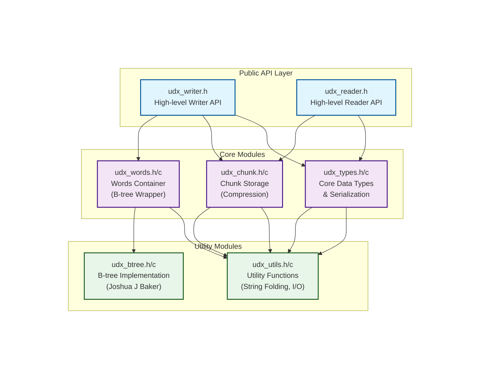
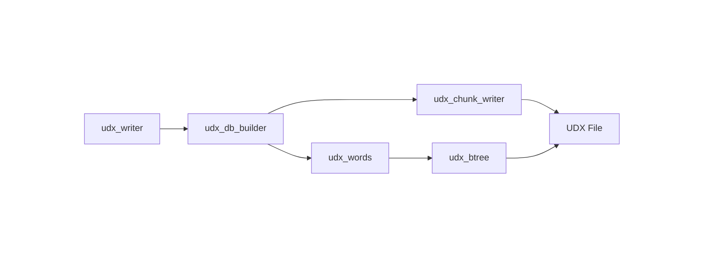
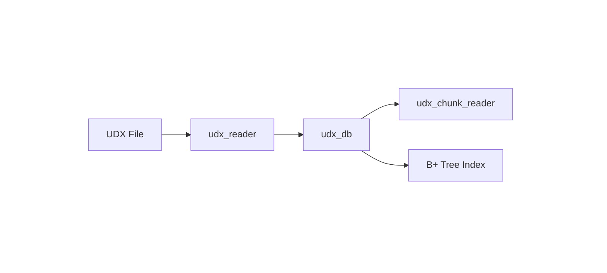

# libudx Architecture

This document describes the internal architecture and design decisions of libudx.

## Key Design Points

- **Chunk Storage**: Data is stored in chunks with independent compression, block offset limited to 16-bit (0-65535)
- **Address Encoding**: 48-bit chunk index + 16-bit offset in chunk
- **Index Structure**: Static B+ tree for efficient O(log n) lookups
- **Checksum**: CRC32 checksum on database header for corruption detection

## Architecture

```
libudx/
└── src/
    ├── udx_writer.h/c    # High-level writer API
    ├── udx_reader.h/c    # High-level reader API
    ├── udx_chunk.h/c     # Chunk-based storage with compression
    ├── udx_words.h/c     # Ordered word container (B-tree wrapper for building)
    ├── udx_types.h/c     # Core data types and serialization
    ├── udx_utils.h/c     # Utility functions (string folding, I/O)
    └── udx_btree.h/c     # B-tree implementation (Joshua J Baker)
```

### Module Architecture Diagram



### Write Flow



### Read Flow



## Design Decisions

### Why B+ Trees?

B+ trees provide predictable O(log n) performance for lookups and naturally support range queries and prefix matching. The static layout (pre-built during write) enables efficient zero-copy parsing during read.

### Why Two Different Tree Structures?

libudx uses **two different tree structures** for different purposes:

| Tree Type | Used By | Purpose |
|-----------|---------|---------|
| **B-tree** | `udx_words` (internal) | Memory storage during **building phase** - dynamic, auto-sorted, supports insertions |
| **B+ tree** | UDX file index | Disk storage in **file format** - static, optimized for reading |

During **write**, entries are added to a dynamic B-tree (`udx_words`) which efficiently handles out-of-order insertions. At the end, this B-tree is traversed in sorted order and converted to a **static B+ tree** that's written to disk. The static B+ tree format enables zero-copy parsing and efficient lookups when reading UDX files.

### Why Chunks?

A **chunk** is a compressed storage unit containing one or more **data blocks**. Each data block represents the actual content (e.g., dictionary definition) for a specific word or entry.

Storing data in chunks with independent compression provides:
- Better compression ratios (similar data compresses together)
- Random access to individual data blocks
- Memory-efficient reading (only decompress what's needed)

**Limitation**: Block offset in chunk is limited to 16-bit (0-65535). Each block's start position is guaranteed to be within this range.

### Case-Insensitive Search

The library uses **word folding** (converting to lowercase) for indexing while preserving the original word case. This enables:
- Case-insensitive lookups ("Hello", "hello", "HELLO" all match)
- Preserved original forms for display
- Efficient B+ tree traversal (sorted by folded form)
